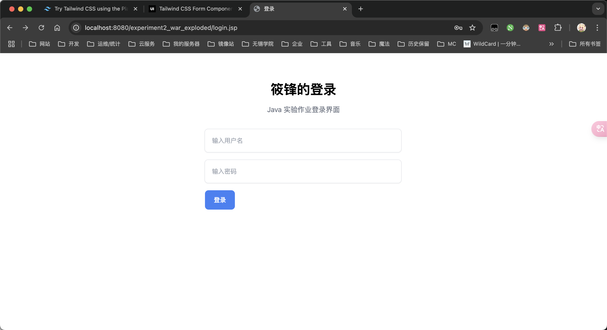
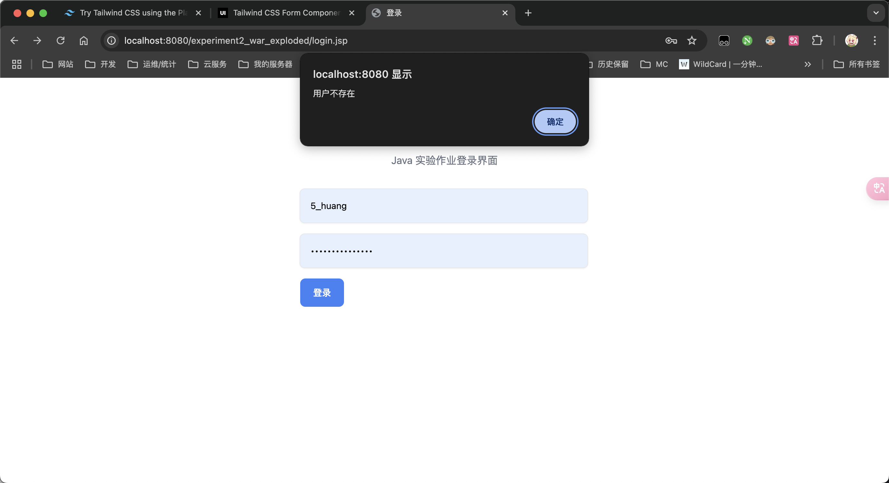
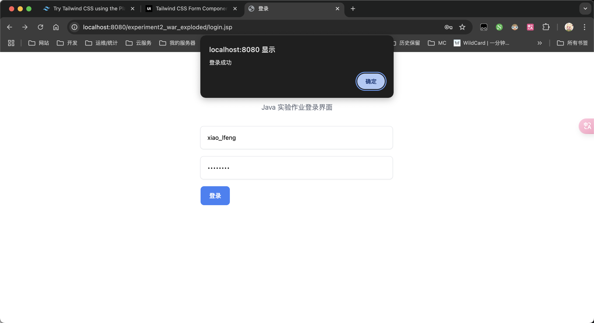
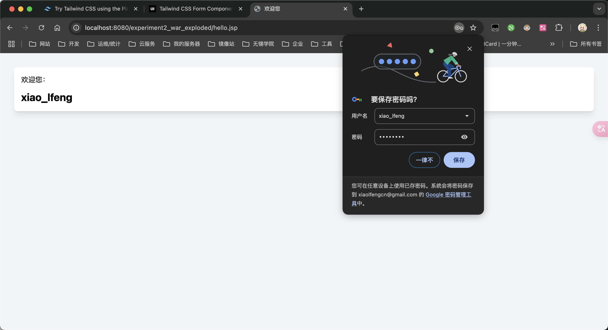
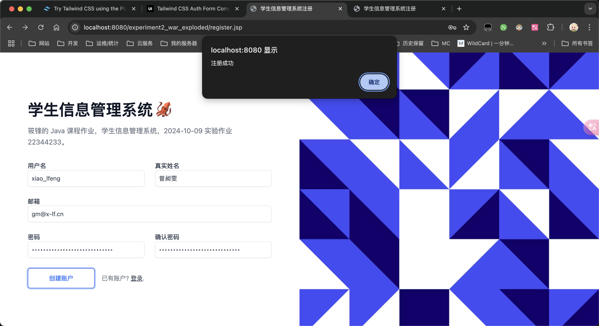
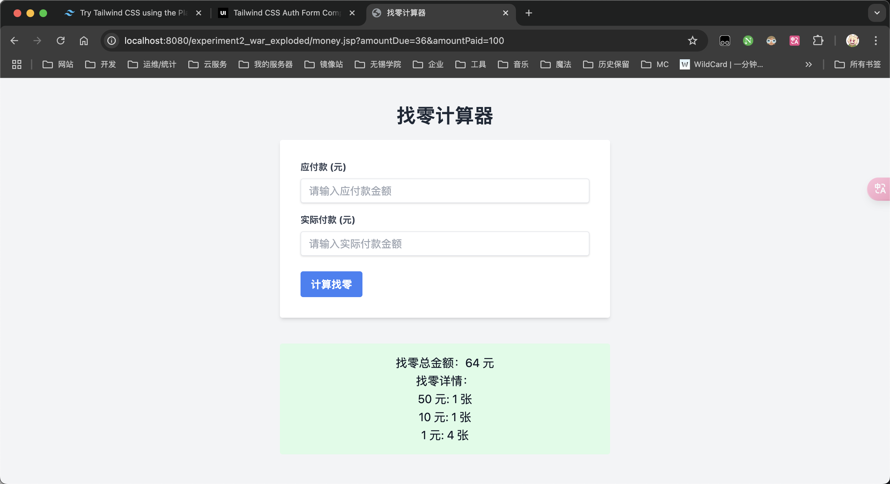
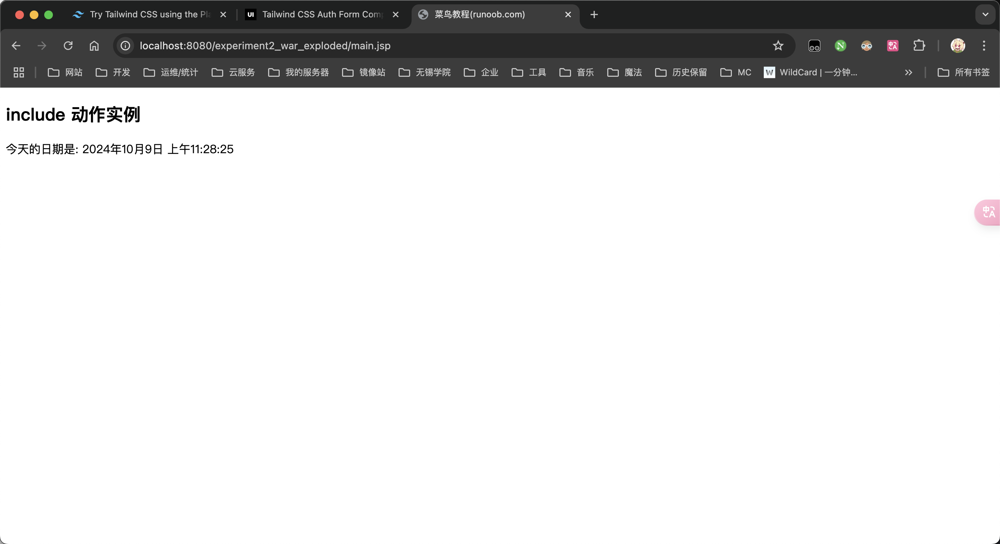
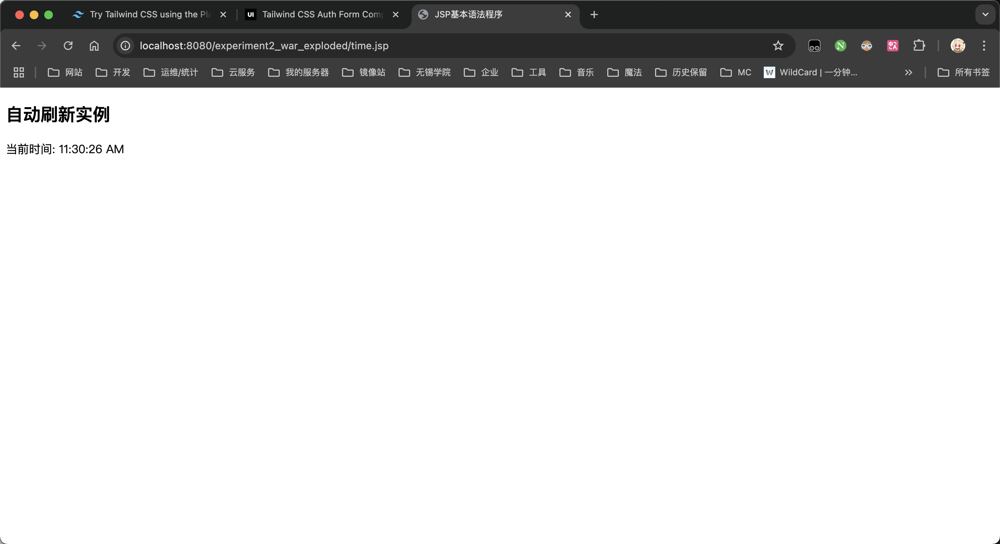
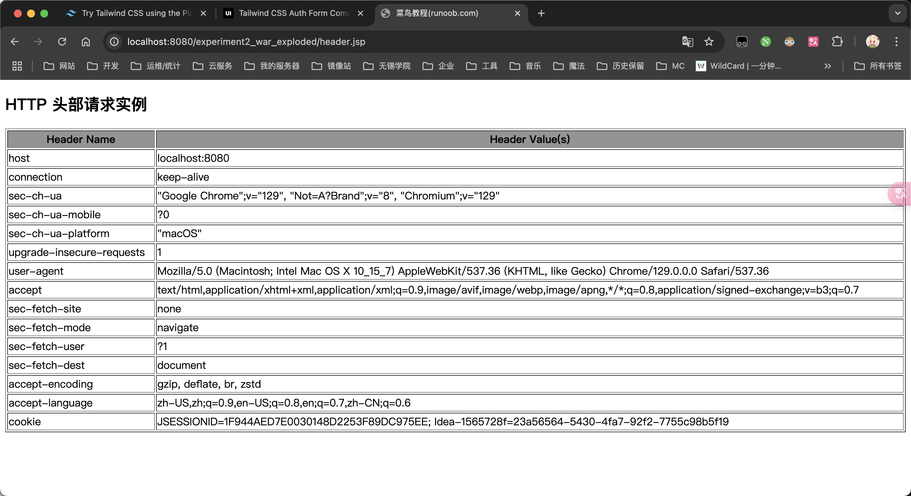

# 实验2 JSP基本语法

## 实验目的

1. 掌握 jsp表达式、程序段和声明，URL传值
2. 熟悉 jsp指令和动作的使用


## 基础相应类

```java
package com.xlf.school.experiment2.model;

/**
 * 基础响应类
 * <p>
 * 用于封装响应数据
 * 该类为所有响应类的基类
 *
 * @since v1.0-SNAPSHOT
 * @since v1.1-SNAPSHOT
 * @author xiao_lfeng
 */
public class BaseResponse {
    private String output;
    private Integer code;
    private String message;
    private String data;

    public String getOutput() {
        return output;
    }

    public BaseResponse setOutput(String output) {
        this.output = output;
        return this;
    }

    public Integer getCode() {
        return code;
    }

    public BaseResponse setCode(Integer code) {
        this.code = code;
        return this;
    }

    public String getMessage() {
        return message;
    }

    public BaseResponse setMessage(String message) {
        this.message = message;
        return this;
    }

    public String getData() {
        return data;
    }

    public BaseResponse setData(String data) {
        this.data = data;
        return this;
    }
}
```


## 实验内容

### 1. 制作一个登录表单，输入账号和密码，如果账号和密码相符，则显示“登录成功”，否则显示“登录失败”。

#### 源代码

```java
package com.xlf.school.experiment2.controller;

import com.google.gson.Gson;
import com.google.gson.reflect.TypeToken;
import com.xlf.school.experiment2.model.BaseResponse;
import jakarta.servlet.annotation.WebServlet;
import jakarta.servlet.http.HttpServlet;
import jakarta.servlet.http.HttpServletRequest;
import jakarta.servlet.http.HttpServletResponse;
import org.jetbrains.annotations.NotNull;

import java.io.IOException;
import java.util.HashMap;
import java.util.logging.Logger;

/**
 * 用户登录控制器
 * <p>
 * 用于处理用户登录请求, 并返回登录结果
 *
 * @author xiao_lfeng
 * @since v1.0-SNAPSHOT
 * @since v1.1-SNAPSHOT
 */
@WebServlet("/api/v1/login")
public class UserLoginController extends HttpServlet {
    private final Logger log = Logger.getLogger(UserLoginController.class.getName());
    private final Gson gson = new Gson();

    @Override
    protected void doPost(@NotNull HttpServletRequest req, @NotNull HttpServletResponse resp) throws IOException {
        resp.setContentType("application/json;charset=utf-8");
        String getBody = req.getReader().readLine();
        HashMap<String, String> getData = gson.fromJson(getBody, new TypeToken<>() {
        });
        log.info("username: " + getData.get("username") + ", password: " + getData.get("password"));
        // 模拟数据库部分数据，支持用户 xiao_lfeng 以及 debug
        if ("xiao_lfeng".equals(getData.get("username"))) {
            if ("20040227".equals(getData.get("password"))) {
                resp.getWriter().print(
                        new Gson().toJson(
                                new BaseResponse()
                                        .setOutput("Success")
                                        .setCode(200)
                                        .setMessage("登录成功")
                        ));
            } else {
                resp.getWriter().print(
                        new Gson().toJson(
                                new BaseResponse()
                                        .setOutput("Fail")
                                        .setCode(400)
                                        .setMessage("登录失败")
                        ));
            }
        } else if ("debug".equals(getData.get("username"))) {
            if ("123456".equals(getData.get("password"))) {
                resp.getWriter().print(
                        new Gson().toJson(
                                new BaseResponse()
                                        .setOutput("Success")
                                        .setCode(200)
                                        .setMessage("登录成功")
                        ));
            } else {
                resp.getWriter().print(
                        new Gson().toJson(
                                new BaseResponse()
                                        .setOutput("Fail")
                                        .setCode(400)
                                        .setMessage("登录失败")
                        ));
            }
        } else {
            resp.getWriter().print(
                    new Gson().toJson(
                            new BaseResponse()
                                    .setOutput("Fail")
                                    .setCode(404)
                                    .setMessage("用户不存在")
                    ));
        }
    }
}
```

```jsp
<%--  login.jsp --%>
<%@ page contentType="text/html;charset=UTF-8" language="java" %>
<!doctype html>
<html lang="zh">
<head>
    <meta charset="UTF-8">
    <meta name="viewport"
          content="width=device-width, user-scalable=no, initial-scale=1.0, maximum-scale=1.0, minimum-scale=1.0">
    <meta http-equiv="X-UA-Compatible" content="ie=edge">
    <title>登录</title>
    <script src="https://cdn.tailwindcss.com"></script>
</head>
<body>
<div class="mx-auto max-w-screen-xl px-4 py-16 sm:px-6 lg:px-8">
    <div class="mx-auto max-w-lg text-center">
        <h1 class="text-2xl font-bold sm:text-3xl">筱锋的登录</h1>

        <p class="mt-4 text-gray-500">
            Java 实验作业登录界面
        </p>
    </div>

    <form action="#" class="mx-auto mb-0 mt-8 max-w-md space-y-4">
        <div>
            <label for="username" class="sr-only relative">
                <input
                        id="username"
                        type="text"
                        class="w-full rounded-lg border border-gray-200 p-4 pe-12 text-sm shadow-sm"
                        placeholder="输入用户名"
                />
            </label>
        </div>
        <div>
            <label for="password" class="sr-only relative">
                <input
                        id="password"
                        type="password"
                        class="w-full rounded-lg border border-gray-200 p-4 pe-12 text-sm shadow-sm"
                        placeholder="输入密码"
                />
            </label>
        </div>

        <div class="flex items-center justify-between">
            <button type="submit"
                    class="inline-block rounded-lg bg-blue-500 px-5 py-3 text-sm font-medium text-white"
            >
                登录
            </button>
        </div>
    </form>
</div>
</body>
<script type="application/javascript">
    document.querySelector('form').addEventListener('submit', function (event) {
        event.preventDefault();
        const username = document.getElementById('username').value;
        const password = document.getElementById('password').value;
        if (username == null || username === '') {
            alert('用户名不能为空');
            return;
        }
        if (password == null || password === '') {
            alert('密码不能为空');
            return;
        }
        // 发送数据
        fetch('api/v1/login', {
            method: 'POST',
            headers: {
                'Content-Type': 'application/json'
            },
            body: JSON.stringify({
                username: username,
                password: password
            })
        }).then(response => {
            if (response.ok) {
                return response.json();
            } else {
                throw new Error('登录失败');
            }
        }).then(data => {
            console.log('data:', data);
            if (data.output === "Success") {
                localStorage.setItem('X-USER-TOKEN', username);
                alert('登录成功');
                window.location.href = 'hello.jsp';
            } else {
                alert(data.message);
            }
        }).catch(error => {
            console.error('error:', error);
            alert('登录失败');
        });
    });
</script>
</html>
```

```jsp
<%-- hello.jsp --%>
<%@ page contentType="text/html;charset=UTF-8" language="java" %>
<!doctype html>
<html lang="zh">
<head>
    <meta charset="UTF-8">
    <meta name="viewport"
          content="width=device-width, user-scalable=no, initial-scale=1.0, maximum-scale=1.0, minimum-scale=1.0">
    <meta http-equiv="X-UA-Compatible" content="ie=edge">
    <title>欢迎您</title>
    <script src="https://cdn.tailwindcss.com"></script>
</head>
<body>
<div class="grid gap-3 min-h-dvh bg-gray-100">
    <div class="m-8">
        <div class="grid gap-3 bg-white rounded-lg shadow-lg p-4">
            <div>欢迎您：</div>
            <div class="font-bold text-2xl" id="dom-user">[USER]</div>
        </div>
    </div>
</div>
</body>
<script type="application/javascript">
    // 页面加载完毕后执行
    window.onload = function () {
        const user = localStorage.getItem('X-USER-TOKEN');
        console.log('user:', user);
        if (user == null || user === '') {
            alert('请先登录');
            window.location.href = 'login.jsp';
        } else {
            document.getElementById('dom-user').innerText = user;
        }
    };
</script>
</html>
```

#### 截图











### 2. 制作一个学生信息管理系统的注册功能，表单的样式自己设计。

#### 源代码

```java
package com.xlf.school.experiment2.controller;

import com.google.gson.Gson;
import jakarta.servlet.ServletException;
import jakarta.servlet.annotation.WebServlet;
import jakarta.servlet.http.HttpServlet;
import jakarta.servlet.http.HttpServletRequest;
import jakarta.servlet.http.HttpServletResponse;
import org.jetbrains.annotations.NotNull;

import java.io.IOException;
import java.util.logging.Logger;

/**
 * 用户注册控制器
 * <p>
 * 用于处理用户注册请求, 并返回注册结果
 *
 * @since v1.0-SNAPSHOT
 * @version v1.0-SNAPSHOT
 * @author xiao_lfeng
 */
@WebServlet("/api/v1/register")
public class UserRegisterController extends HttpServlet {
    private final Logger log = Logger.getLogger(UserRegisterController.class.getName());

    @Override
    protected void doPost(@NotNull HttpServletRequest req, @NotNull HttpServletResponse resp) throws IOException {
        // 接收消息体
        String getBody = req.getReader().readLine();
        log.info("RequestBody: " + getBody);
        // 输出消息体
        resp.setContentType("application/json;charset=utf-8");
        resp.getWriter().print(getBody);
    }
}
```

```java
<%@ page contentType="text/html;charset=UTF-8" language="java" %>
<!doctype html>
<html lang="zh">
<head>
    <meta charset="UTF-8">
    <meta name="viewport"
          content="width=device-width, user-scalable=no, initial-scale=1.0, maximum-scale=1.0, minimum-scale=1.0">
    <meta http-equiv="X-UA-Compatible" content="ie=edge">
    <title>学生信息管理系统注册</title>
    <script src="https://cdn.tailwindcss.com"></script>
</head>
<body>
<section class="bg-white">
    <div class="lg:grid lg:min-h-screen lg:grid-cols-12">
        <aside class="relative block h-16 lg:order-last lg:col-span-5 lg:h-full xl:col-span-6">
            
        </aside>

        <main
                class="flex items-center justify-center px-8 py-8 sm:px-12 lg:col-span-7 lg:px-16 lg:py-12 xl:col-span-6"
        >
            <div class="max-w-xl lg:max-w-3xl">
                <h1 class="mt-6 text-2xl font-bold text-gray-900 sm:text-3xl md:text-4xl">
                    学生信息管理系统 🦑
                </h1>

                <p class="mt-4 leading-relaxed text-gray-500">
                    筱锋的 Java 课程作业，学生信息管理系统，2024-10-09 实验作业 22344233。
                </p>

                <form action="#" class="mt-8 grid grid-cols-6 gap-6">
                    <div class="col-span-6 sm:col-span-3">
                        <label for="username" class="block text-sm font-medium text-gray-700">
                            用户名
                        </label>
                        <input
                                type="text"
                                id="username"
                                name="username"
                                class="p-2 border w-full rounded-md border-gray-200 bg-white text-sm text-gray-700 shadow-sm"
                        />
                    </div>
                    <div class="col-span-6 sm:col-span-3">
                        <label for="realname" class="block text-sm font-medium text-gray-700">
                            真实姓名
                        </label>

                        <input
                                type="text"
                                id="realname"
                                name="realname"
                                class="p-2 border w-full rounded-md border-gray-200 bg-white text-sm text-gray-700 shadow-sm"
                        />
                    </div>
                    <div class="col-span-6">
                        <label for="email" class="block text-sm font-medium text-gray-700">
                            邮箱
                        </label>
                        <input
                                type="email"
                                id="email"
                                name="email"
                                class="p-2 border w-full rounded-md border-gray-200 bg-white text-sm text-gray-700 shadow-sm"
                        />
                    </div>

                    <div class="col-span-6 sm:col-span-3">
                        <label for="password" class="block text-sm font-medium text-gray-700">
                            密码
                        </label>
                        <input
                                type="password"
                                id="password"
                                name="password"
                                class="p-2 border w-full rounded-md border-gray-200 bg-white text-sm text-gray-700 shadow-sm"
                        />
                    </div>

                    <div class="col-span-6 sm:col-span-3">
                        <label for="password_confirm" class="block text-sm font-medium text-gray-700">
                            确认密码
                        </label>
                        <input
                                type="password"
                                id="password_confirm"
                                name="password_confirm"
                                class="p-2 border w-full rounded-md border-gray-200 bg-white text-sm text-gray-700 shadow-sm"
                        />
                    </div>
                    <div class="col-span-6 sm:flex sm:items-center sm:gap-4">
                        <button
                                class="inline-block shrink-0 rounded-md border border-blue-600 bg-blue-600 px-12 py-3 text-sm font-medium text-white transition hover:bg-transparent hover:text-blue-600 focus:outline-none focus:ring active:text-blue-500"
                        >
                            创建账户
                        </button>

                        <p class="mt-4 text-sm text-gray-500 sm:mt-0">
                            已有账户?
                            <a href="login.jsp" class="text-gray-700 underline">登录</a>.
                        </p>
                    </div>
                </form>
            </div>
        </main>
    </div>
</section>
</body>
<script type="application/javascript">
    document.querySelector('form').addEventListener('submit', function (event) {
        event.preventDefault();
        const username = document.getElementById('username').value;
        const realname = document.getElementById('realname').value;
        const email = document.getElementById('email').value;
        const password = document.getElementById('password').value;
        const password_confirm = document.getElementById('password_confirm').value;
        if (username == null || username === '') {
            alert('用户名不能为空');
            return;
        }
        if (realname == null || realname === '') {
            alert('真实姓名不能为空');
            return;
        }
        if (email == null || email === '') {
            alert('邮箱不能为空');
            return;
        }
        if (password == null || password === '') {
            alert('密码不能为空');
            return;
        }
        if (password_confirm == null || password_confirm === '') {
            alert('确认密码不能为空');
            return;
        }
        if (password !== password_confirm) {
            alert('两次密码输入不一致');
            return;
        }
        // 发送数据
        fetch('api/v1/register', {
            method: 'POST',
            headers: {
                'Content-Type': 'application/json'
            },
            body: JSON.stringify({
                username: username,
                realname: realname,
                email: email,
                password: password
            })
        }).then(response => {
            return response.json();
        }).then(data => {
            alert(data);
        }).catch(error => {
            alert('注册失败');
        });
    });
</script>
</html>
```

#### 截图




### 3. 编写一个“计算找零”的页面，在页面上输入应付款、实际付款，提交，在页面底部显示应该找零的数量和各种面值的张数，例如：找零是56元，应付款为50元1张，5元1张，1元1张。假设有50、20、10、5、1这5种面值。

#### 源代码

```jsp
<%@ page contentType="text/html;charset=UTF-8" language="java" %>
<%@ page import="java.util.LinkedHashMap" %>
<%
    // 获取表单输入数据
    String amountDue = request.getParameter("amountDue");
    String amountPaid = request.getParameter("amountPaid");
    String changeResult = "";

    // 判断是否已输入应付款和实际付款
    if (amountDue != null && amountPaid != null && !amountDue.isEmpty() && !amountPaid.isEmpty()) {
        try {
            int due = Integer.parseInt(amountDue);
            int paid = Integer.parseInt(amountPaid);
            int change = paid - due;

            // 计算找零
            if (change < 0) {
                changeResult = "付款不足！请支付足够金额。";
            } else if (change == 0) {
                changeResult = "没有找零，您支付的金额正好。";
            } else {
                // 面值数组
                int[] denominations = {50, 20, 10, 5, 1};
                LinkedHashMap<Integer, Integer> changeDetails = new LinkedHashMap<>();

                // 计算每种面值的张数
                for (int denom : denominations) {
                    int count = change / denom;
                    if (count > 0) {
                        changeDetails.put(denom, count);
                        change -= denom * count;
                    }
                }

                // 拼接找零信息
                StringBuilder sb = new StringBuilder();
                sb.append("找零总金额：").append(paid - due).append(" 元<br>");
                sb.append("找零详情：<br>");
                for (Integer denom : changeDetails.keySet()) {
                    sb.append(denom).append(" 元: ").append(changeDetails.get(denom)).append(" 张<br>");
                }
                changeResult = sb.toString();
            }
        } catch (NumberFormatException e) {
            changeResult = "输入格式错误，请输入整数金额。";
        }
    }
%>
<!DOCTYPE html>
<html lang="zh">
<head>
    <meta charset="UTF-8">
    <title>找零计算器</title>
    <script src="https://cdn.tailwindcss.com"></script>
</head>
<body class="bg-gray-100 text-gray-800">
<div class="container mx-auto mt-10">
    <h1 class="text-3xl font-bold text-center mb-5">找零计算器</h1>
    <div class="bg-white p-8 rounded shadow-md max-w-lg mx-auto">
        <form method="GET" action="money.jsp">
            <div class="mb-4">
                <label class="block text-gray-700 text-sm font-bold mb-2" for="amountDue">
                    应付款 (元)
                </label>
                <input type="text" id="amountDue" name="amountDue"
                       class="shadow appearance-none border rounded w-full py-2 px-3 text-gray-700 leading-tight focus:outline-none focus:shadow-outline"
                       placeholder="请输入应付款金额">
            </div>
            <div class="mb-6">
                <label class="block text-gray-700 text-sm font-bold mb-2" for="amountPaid">
                    实际付款 (元)
                </label>
                <input type="text" id="amountPaid" name="amountPaid"
                       class="shadow appearance-none border rounded w-full py-2 px-3 text-gray-700 leading-tight focus:outline-none focus:shadow-outline"
                       placeholder="请输入实际付款金额">
            </div>
            <div class="flex items-center justify-between">
                <button type="submit"
                        class="bg-blue-500 hover:bg-blue-700 text-white font-bold py-2 px-4 rounded focus:outline-none focus:shadow-outline">
                    计算找零
                </button>
            </div>
        </form>
    </div>
    <div class="mt-10 text-center text-lg bg-green-100 p-4 rounded max-w-lg mx-auto">
        <% if (!changeResult.isEmpty()) { %>
        <div class="text-gray-900">
            <%= changeResult %>
        </div>
        <% } %>
    </div>
</div>
</body>
</html>
```

#### 截图





### 4. 看程序写结果（一）：jsp:include动作元素的使用




### 5. 看程序写结果（二）：使用setIntHeader()方法和setRefreshHeader()方法来模拟一个数字时钟




### 6. 看程序写结果（三）：HTTP信息头示例

